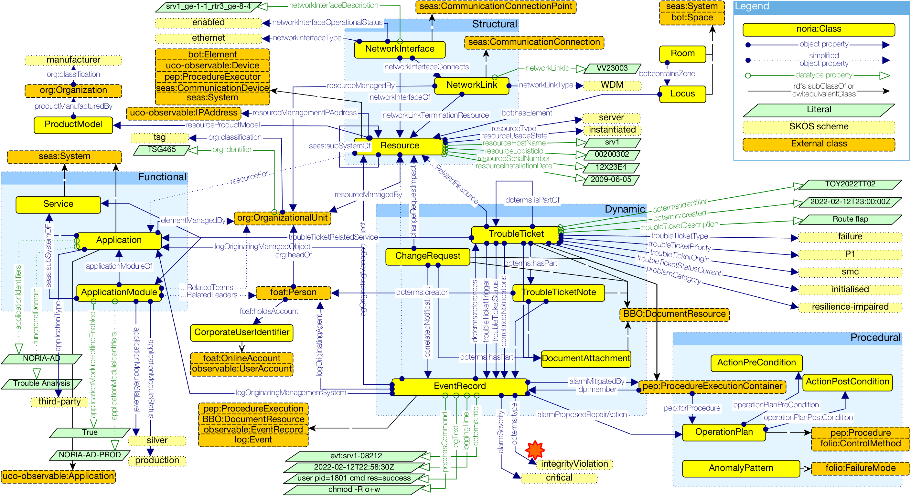

# noria-ontology

The **NORIA-O** project is a data model for IT networks, events and operations information.
The ontology is developed using web technologies (e.g. RDF, OWL, SKOS) and is intended as a structure for realizing an IT Service Management (ITSM) Knowledge Graph (KG) for Anomaly Detection (AD) and Risk Management applications.
The model has been developed in collaboration with operational teams, and in connection with third parties linked vocabularies.

Cite:

```bibtex
@inproceedings{noria-o-2024,
  title     = {NORIA-O: an Ontology for Anomaly Detection and Incident Management in ICT Systems},
  author    = {{Lionel Tailhardat} and {Yoan Chabot} and {Rapha\"el Troncy}},
  booktitle = {Semantic Web - 21st International Conference, ESWC 2024, Hersonissos, Crete, Greece, May 26 - 30, 2024, Proceedings},
  year      = {2024},
  doi       = {10.1007/978-3-031-60635-9_2}
}
```

Overview of the data model:



## Usage

We provide a direct access to the NORIA-O resources with the **noria** [w3id.org](https://w3id.org/) identifier:
> [https://w3id.org/noria/](https://w3id.org/noria/)

Based on this identifier, the following links apply for direct access to the NORIA-O featured topics:

| NORIA-O              | Link                               |
|----------------------|------------------------------------|
| Ontologies           | https://w3id.org/noria/ontology/   |
| Documentation        | https://w3id.org/noria/doc/        |
| Vocabularies         | https://w3id.org/noria/kos/        |
| Competency Questions | https://w3id.org/noria/cqs/        |
| Authoring Tests      | https://w3id.org/noria/evaluation/ |

See also the *Repository Structure* for navigating into this repository:
```
noria-ontology
├───cqs <Ontology Requirements and Specification> (e.g. Competency Questions)
├───dataset <toy example for examplification of the NORIA-O model>
├───docs <documentation, diagrams and figures>
├───evaluation <NORIA-O evaluation tool set> (e.g. Authoring Tests)
├───kos <NORIA-O controlled vocabulary> (e.g. codelists)
└───ontology <the NORIA-O implementation>
```

## Copyright

Copyright (c) 2020-2025, Orange / EURECOM. All rights reserved.

## License

[BSD-4-Clause](LICENSE.txt).

## Maintainer

* [Lionel TAILHARDAT](mailto:lionel.tailhardat@orange.com)
* [Yoan CHABOT](mailto:yoan.chabot@orange.com)
* [Raphaël TRONCY](mailto:raphael.troncy@eurecom.fr)