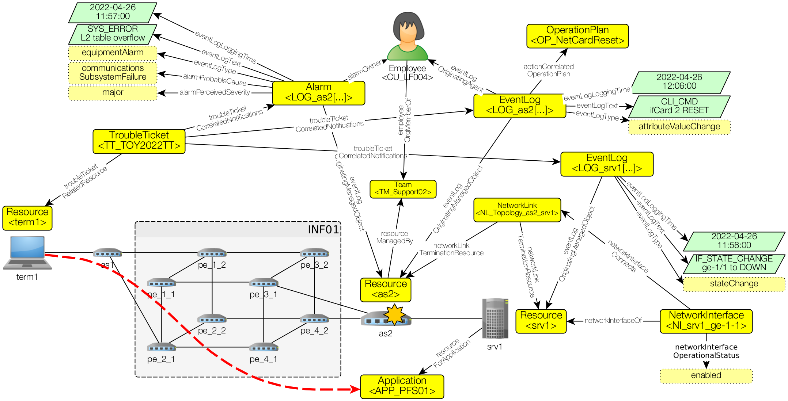

# noria-ontology / dataset

This folder contains the dataset for the **NORIA fictitious case of supervision of a network infrastructure**.

General approach:
* Design a use case from raw data in the [datasource/](datasource/) directory,
* Transform raw data into RDF with the RML mapping rules of the [engine/](engine/) directory,
* Load the RDF data of the [output/](output/) directory into a graph datastore for further exploration.

Data provided in the [output/](output/) directory reflects the following situation:  


## Generating the KG from datasource/

Prerequisite:
* RMLMapper Docker image (see https://rml.io/)

Generating data:
* (linux) call the `build-kg-*` tasks from the `makefile`, then browse the [output/](output) directory.
```shell
# Build data
make build-kg
```

