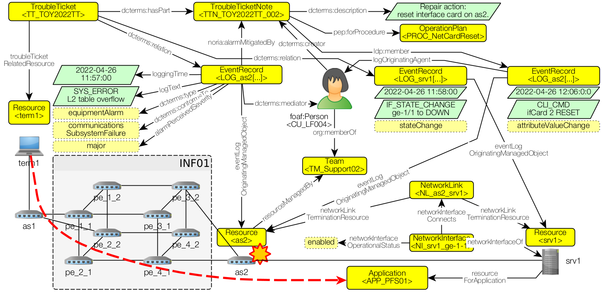

# noria-ontology / dataset for v0.2
This folder contains the dataset for the **NORIA fictitious case of supervision of a network infrastructure**.

General approach:
* Design a use case from raw data in the [datasource/](datasource/) directory,
* Transform raw data into RDF with the RML mapping rules of the [engine/](engine/) directory,
* Load the RDF data of the [output/](output/) directory into a graph datastore for further exploration.

Data provided in the [output/](output/) directory reflects the following situation:  


Note that all files in the [output/](output/) directory are generated (see below) but the following ones:

* [output/noria_events.ttl](output/noria_events.ttl): a hand-made dataset for describing the situation from the *event* and *document* perspectives.
* [output/virtdb-config.sql](output/virtdb-config.sql): a helper file for configuring a local Virtuoso DB instance. 

## Generating the KG from datasource

Prerequisite:

* [rmlio/rmlmapper-java](https://hub.docker.com/r/rmlio/rmlmapper-java) Docker image.
* (optional) [rmlio/yarrrml-parser](https://hub.docker.com/r/rmlio/yarrrml-parser) Docker image.
* (optional) [openlink/virtuoso-opensource-7](https://hub.docker.com/r/openlink/virtuoso-opensource-7) Docker image.

Generating and exploring data:

* (linux) call the `build-kg-*` tasks from the `makefile`, then browse the [output/](output) directory.
* Load the resulting data into your favorite data store.

Quick start:

```shell
# Install requirements and development tools
make install-dev-tools

# Build data (all)
make build-kg

# Start a local Virtuoso DB instance
make virtdb-start
make virtdb-config

# Load data
make push-kg-virtdb

# Browse data in http://localhost:8890
```

